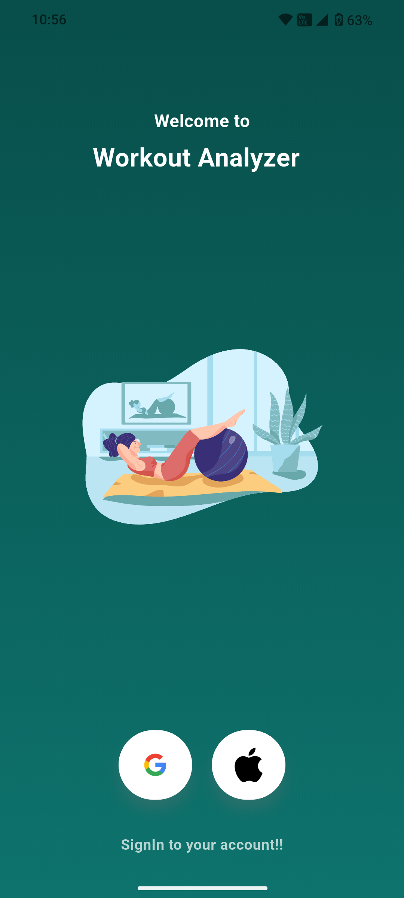
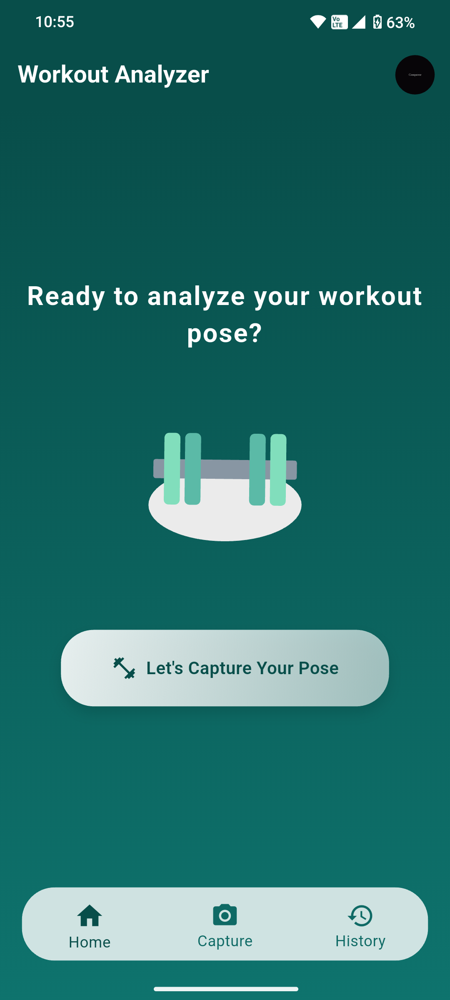
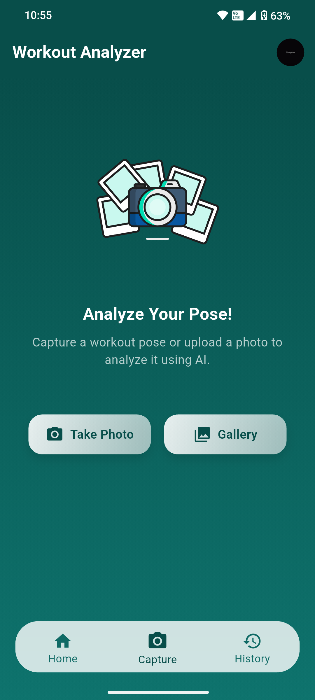
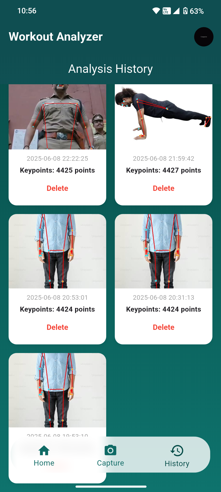
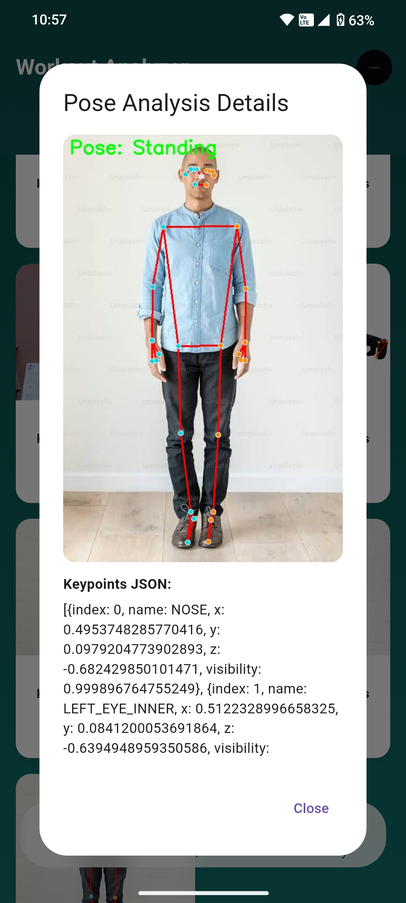
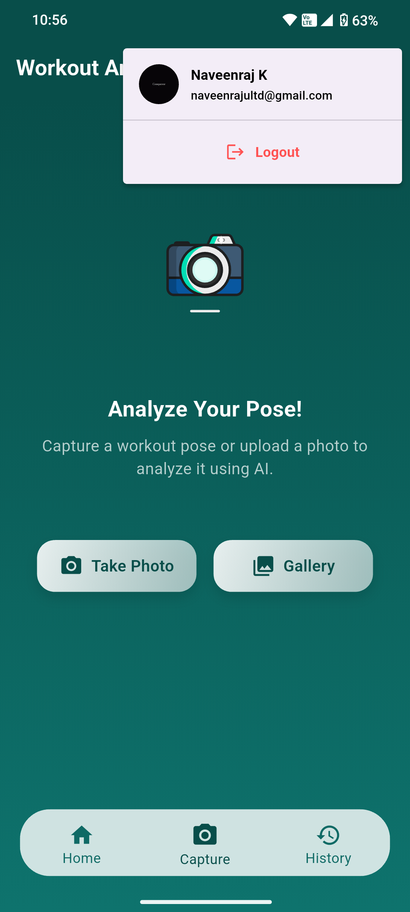

# workout_analyzer
    
## Workout Analyzer is a A fully functional flutter project which detects the human workout pose and returns name of the pose and points of the analysis in a JSON format!

This project is a part of the interview process at SMARTAN FITTECH PRIVATE LIMITED for the role of flutter developer intern given as an assignment task > "Flutter App for MediaPipe Pose Analysis with Local & Cloud Sync". 

---

## Features

* Google authentication for login and logout
* Image pose analysis through mediapipe backend using Flask and FastAPI
* Local sqlite storage to store the last login and JSON points
* Firebase storage to store the image data's
* Firestore Database to store the Date and Time data, Image ID, User ID, JSON Body keypoints

---

## Steps to Impletemt the Project

```bash
# Clone the repository
git clone https://github.com/NAVEENRAJ2004/workout_analyzer.git

# Install dependencies
flutter pub get

# Run the app
flutter run
```

---

## Mediapipe Backend Implementation

```bash
# Clone the backend repository
git clone https://github.com/NAVEENRAJ2004/workout_analyzer_backend.git

# Install requirements.txt
pip install -r requirements.txt

# Run the Backend
python app.py
```

---


## Firebase Config

* Create a Firebase project in the Firebase Console

* Add an Android/iOS app to your project.

* Download the configuration file: google-services.json → Place in android/app/ | GoogleService-Info.plist → Place in ios/Runner/ (for iOS)

* Enable the following in Firebase: Google Sign-In under Authentication > Sign-in method | Firestore under Build > Firestore Database | Firebase Storage under Build > Storage

---

# Folder Structure
```
lib/
├── config/
│   └── firebase_options.dart             # Firebase configuration
│
├── models/
│   ├── keypoint_model.dart               # Model for pose keypoints
│   └── user_model.dart                   # Model for user data
│
├── screens/
│   ├── auth/
│   │   └── login_screen.dart             # Google login screen
│   │
│   ├── capture/
│   │   └── photo_capture_screen.dart     # UI for capturing workout images
│   │
│   ├── controllers/
│   │   └── capture_controller.dart       # Controller logic for image capture
│   │
│   ├── history/
│   │   └── history_screen.dart           # Screen to view captured history
│   │
│   ├── navigation/
│   │   └── main_navigation_screen.dart   # Bottom/tab navigation UI
│   │
│   └── home_screen.dart                  # Main home/dashboard screen
│
├── services/
│   ├── firebase_service.dart             # Firebase Auth, Firestore, Storage
│   ├── local_db_service.dart             # SQLite local storage handler
│   └── media_pipe_service.dart           # MediaPipe API integration
│
└── main.dart                              # Entry point of the application
```

---

## 📸 Screenshots

### Login Page


### Home Page


### Photo Capture


### History Page


### Image JSON Preview


###  Profile Bar
